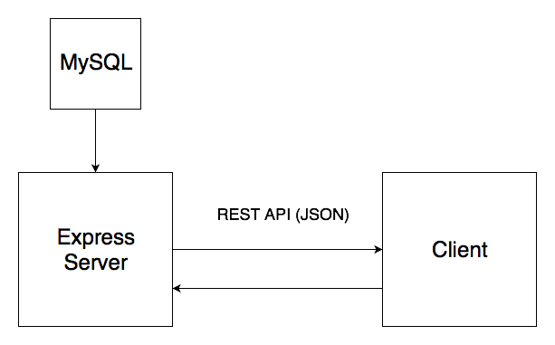

# Opentutr.com

A non-profit tutor booking platform that aims to connect volunteering tutors with students.  

## Getting Started

These instructions will get you a copy of the project up and running on your local machine for development and testing purposes.  

## Structure and Information Flow

By using the above structure, we ensure that the API and the client are seperate. This helps in reducing spaghetti code, and allows for further platform/language independent extensions in the future. The client is not aware of the internal structure of the API. All the client needs to know, is where to send a request.

## Development Overview
Promises and the async/await syntax, which was introduced in JS ES6 are used consistently in this project.

### Express
For this project Express.js is used as a starting point. Of course, various customizations are needed to completely tackle security issues.

### React Redux
Through Redux, the data is efficiently and effectively displayed according to the application state, without tight coupling the react components. To connect react and redux the react redux library is used, that provides the functions mapStateToProps, mapDispatch to props, and the connect function. This way we can retrieve the data, by obtaining their current state, or by dispatching an action. At this development stage, Redux could have been omitted as it is mainly used for propagating the authentication state. But redux is used to set the grounds for future development, that will keep the codebase simple and clean.

Redux thunk is a middleware that injects a dispatch function to the action creators. The reason for this is that we do not want the action to be dispatched before the API request is completed. Once the promise is resolve the action can then be dispatched. With redux thunk the action creator does not immediately return an action, but it calls the dispatch function with an action, that allows to manually dispatch the action whenever needed, by giving a handle to the dispatch function. Then it is forwarded to the reducers, which update the redux store. For example, in login, the action creator will create a AJAX request to the API /api/user endpoint to check if the user is logged, and once the request is resolved the action will be dispatched to the different reducers.

### Database
First, the applications data requirements were defined in detail, along with list of queries we needed. A normalized database schema was designed, which was later de-normalized as needed to improve efficiency and reduce query complexity. MySQL npm package was used to manage the database connection. The npm package was written using callbacks. Therefore, each query was wrapped in a promise and the async/await syntax was used.

### Authentication
During the registration process, the password is encrypted using SHA512 and a randomly generated salt. The encryption is done using the crypto library available with node.js. The hashed password, and the salt are then stored in the database.  

During the login, the submitted password is encrypted using the stored salt, and compared with the stored hashsalted password.

### User sessions
The user session is stored with a cookie in the client’s browser. The cookie-session package is a lightweight cookie based middleware, that is used to create the cookie. If the user is authenticated the API returns a response with a Set-Cookie header.  
The Passport.js package is using the session object to keep track of a logged in user in a given session. The function passport.deserializeUser is modified so it retrieves the user information associated with a userid. The req.user property is the result of user deserialization.

### Future Directions
-Data Security such as securing express and the API access.
-Server side data validation.
-Utilizing a framework such as OWASP to avoid XSS attacks.
-Database tuning in terms of queries and performance.
-Extending the API functionality.
-Extending the website functionality
-Refine the frontend.

## Built With

* Node.js
* Express.js
* React.js
* Redux
* Reactstrap
* LetsEncrypt

## Authors

* **Evan Lalopoulos** - [evanlal](https://github.com/evanlal)
* **Harrison Boyns** - [Boyns2017](https://github.com/Boyns2017)

## License
A project for Web Technologies  
University of Bristol, May 2018  

Written by:  
- Evan Lalopoulos <evan.lalopoulos.2017@my.bristol.ac.uk>  
- Harrison Boyns <hb17757.2017@my.bristol.ac.uk>  

Copyright (C) - All Rights Reserved  
Unauthorized copying of this file is strictly prohibited  

